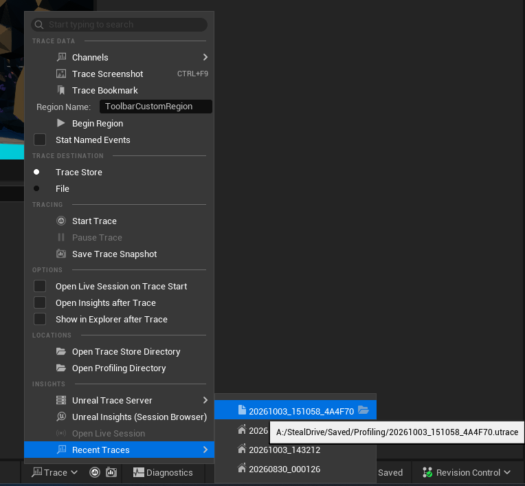
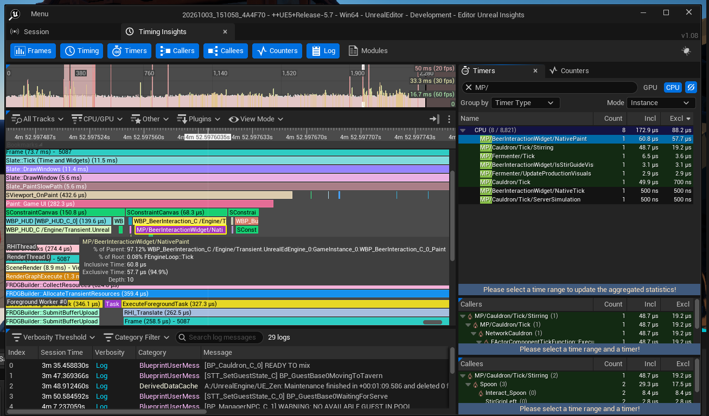
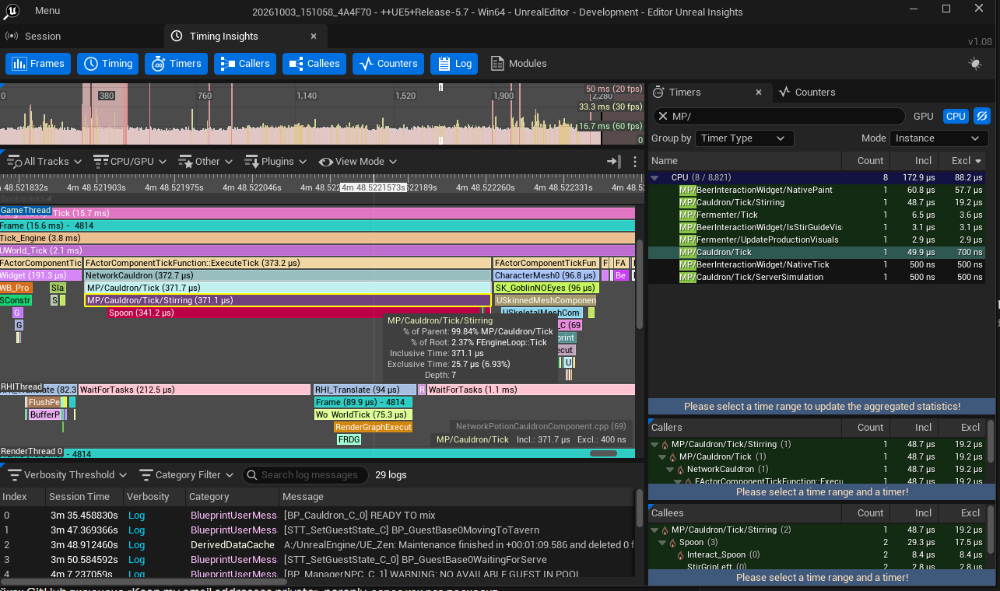
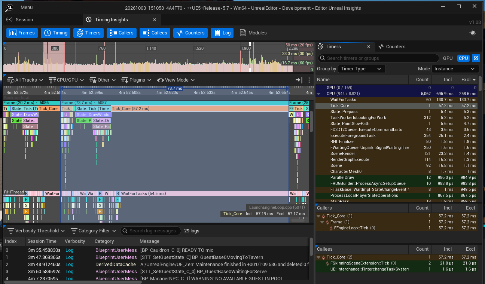

# UE Insights Profiling Skill

<p align="center">
  <video src="https://github.com/olegsheyko/odius-UnrealProfilerSkill/raw/main/assets/ue-insights-profiling-promo.mp4" controls muted width="100%"></video>
</p>

<p align="center">
  <a href="assets/ue-insights-profiling-promo.mp4">&#9654; Watch the trailer</a> (use this link if the player above does not load)
</p>

Find out what makes your Unreal Engine game slow, without learning the Unreal Insights window first.

Tell your AI assistant "mark the Fermenter for profiling" or "look at my last trace and tell me what costs FPS".
It adds the measurements to your code, reads the trace file, and explains the result in plain words.

This repository holds one skill: [`ue-insights-profiling/`](ue-insights-profiling/).

## Contents

1. [What can it do?](#what-can-it-do)
2. [What do I need?](#what-do-i-need)
3. [Install (once per developer)](#install-once-per-developer)
4. [How to use it](#how-to-use-it)
5. [Record and open a trace](#record-and-open-a-trace)
6. [Check that your marks are in the trace](#check-that-your-marks-are-in-the-trace)
7. [Find the source file of a mark](#find-the-source-file-of-a-mark)
8. [What you see in the Insights window](#what-you-see-in-the-insights-window)
9. [Use it without an AI](#use-it-without-an-ai)
10. [Good to know](#good-to-know)
11. [What is inside](#what-is-inside)
12. [Troubleshooting](#troubleshooting)

---

## What can it do?

**1. Add profiling marks to your code**
- You name a mechanic, a class or a file. The assistant finds the code and adds trace marks.
- Every mark gets a clear name (`Fermenter/Tick`) and a short comment, so everyone on the team knows what is measured.
- It checks its own work: no duplicate names, no broken marks, and the project still builds.
- It does not change how your game works. It only adds measurements.

**2. Read a trace file for you**
- Finds which parts of the game take the most time in every frame (CPU, UI, rendering and GPU).
- Tells you if the frame is limited by the game thread, the render thread or the GPU.
- Finds hitches (sudden slow frames) and says what caused each one.
- Shows how much your own mechanics cost, in milliseconds per frame.
- Compares two traces (before and after your change).
- Works from the command line. You do not need to open the Unreal Insights window.

**3. See Blueprint, State Tree and Behavior Tree costs**
- Shows which Blueprint functions, widgets, animation Blueprints and State Tree tasks are slow, without changing any Blueprint.
- In the editor it works whenever the trace records the CPU. In other builds, tick **Stat Named Events** in the Trace menu (see [Record and open a trace](#record-and-open-a-trace)).
- Works down to the function or event level. It cannot split a single event graph into nodes.

**4. Mark parts inside Blueprint functions**
- The project gets a small set of Blueprint nodes: **Begin/End Profile Scope**, **Begin/End Profile Region** and **Profile Bookmark**.
- Blueprint authors (AI, State Tree, widgets) put them around any part of a graph, with no C++ needed.
- The assistant tells you which Blueprint and which part to mark, using the trace. See
  [`docs/blueprint.md`](ue-insights-profiling/docs/blueprint.md) for the rules.

**5. Find the code behind the numbers and suggest fixes**
- After the analysis, the assistant finds the source files and lines behind the biggest costs and the hitches.
- It reads that code and suggests fixes **only for the problems the trace found**. Each suggestion has the number,
  the file and line, the reason, the fix, the estimated gain, the risk, and how to check it.
- It does not change your code until you choose what to apply.
- If the assistant cannot see your project, it asks you to connect the project folder (or to paste the files).
- After you apply a fix, record the same scenario again and it compares the two traces.

**6. Help you record a trace**
- Gives you the right command and the steps for a clean recording.

[Back to top](#ue-insights-profiling-skill)

---

## What do I need?

- An Unreal Engine C++ project (tested with UE 5.7 on Windows).
- Python 3.8 or newer. No extra packages are needed.
- An AI assistant that can use skills (for example Claude Code or Codex), or any chat assistant
  (see [Use it without an AI](#use-it-without-an-ai)).

[Back to top](#ue-insights-profiling-skill)

---

## Install (once per developer)

1. Download or clone this repository.
2. Copy the folder `ue-insights-profiling` into the skills folder of your AI tool. Keep the folder name.

| Tool | Skills folder |
|---|---|
| Claude Code (all projects) | `~/.claude/skills/ue-insights-profiling/` |
| Claude Code (one project) | `<your project>/.claude/skills/ue-insights-profiling/` |
| Codex CLI | `~/.codex/skills/ue-insights-profiling/` |
| Another agent | Any folder. Tell the agent: "Read `<path>/SKILL.md` and follow it." |

3. To update later, pull the latest version and copy the folder again.

[Back to top](#ue-insights-profiling-skill)

---

## How to use it

Just ask in your own words. You do not need to type the skill name. For example:

- "Mark the OrderBoard for the profiler."
- "Add Unreal Insights measurements to the inventory code."
- "Look at the latest trace. What costs FPS?"
- "Why do I get stutters in this trace?"
- "Compare these two traces. Did my change help?"
- "Analyze the trace and suggest how to fix the problems you found."
- "How do I record a trace?"

Russian works too, for example "разметь Fermenter для профилировщика" or "глянь последний трейс, что жрёт фпс".

### A simple first session

1. Ask the assistant to mark a mechanic. Close the Unreal Editor when it asks to build.
2. [Record a trace](#record-and-open-a-trace) while you play the mechanic for about 30 seconds.
3. Ask the assistant to analyze the trace.
4. Read the report. It tells you the biggest costs and what to check next.
5. Let the assistant read your project folder (connect it to the chat or the agent). It then points to the code
   behind the costs and suggests fixes. Choose which ones to apply, record again, and compare.

[Back to top](#ue-insights-profiling-skill)

---

## Record and open a trace

You can record a trace from the Unreal Editor without any command line.

1. Open the **Trace** menu in the bottom toolbar of the editor.
2. If you do not see Blueprint function names in your trace, tick **Stat Named Events** in the same menu and record again.
   Under **Trace Destination**, choose **File** if you want a `.utrace` file on disk
   (for example in `Saved/Profiling`). **Trace Store** keeps the trace in Unreal's own trace storage.
3. Click **Start Trace**. Play the mechanic for 20 to 30 seconds. Open the same menu again to stop the trace.
4. To open the result, go to **Trace > Recent Traces** and click your trace. It opens in Unreal Insights.
   Hover over a trace to see its file path. **Open Profiling Directory** opens the folder with your trace files.



*The Trace menu. Use Start Trace to record and Recent Traces to open a finished trace.*

For the most honest numbers, record a standalone game instead of the editor.
See [`docs/capture.md`](ue-insights-profiling/docs/capture.md) for the exact commands.

[Back to top](#ue-insights-profiling-skill)

---

## Check that your marks are in the trace

After the assistant adds marks, make sure they show up in Insights:

1. Open the trace in Unreal Insights.
2. In the **Timers** panel (top right), type your project prefix in the search box. In this project the prefix is `MP/`.
3. You should see a list of your marks, for example `MP/Cauldron/Tick` and `MP/Fermenter/Tick`.
   Each row shows how many times it ran (**Count**) and how long it took (**Incl** and **Excl**).
4. Hover over a bar in the timeline to see its details: time, share of its parent, and depth.



*The Timers panel filtered with `MP/`. The tooltip shows the cost of one mark.*

If the list is empty, rebuild the editor and record again. See [Troubleshooting](#troubleshooting).

[Back to top](#ue-insights-profiling-skill)

---

## Find the source file of a mark

Click a bar in the timeline. At the bottom right of the timeline, Insights shows the source file and line number
of that mark, for example `NetworkPotionCauldronComponent.cpp (69)`.

You can also search your code for the mark name. The `MP/` prefix is added by the macro, so search without it:

```
grep -rn "Cauldron/Tick/Stirring" Source
```

Or ask your assistant: "Where in the code is the mark `MP/Cauldron/Tick/Stirring`?"



*A selected bar. The source file and line appear at the bottom right of the timeline.*

[Back to top](#ue-insights-profiling-skill)

---

## What you see in the Insights window

You do not have to read this window yourself, because the assistant reads the trace for you. If you want to look
anyway, this is what the main parts are:

- **Top strip (Frames):** one bar per frame. A tall bar is a slow frame (a hitch).
- **Middle (timeline):** what each thread did, over time. A wider bar means more time. Bars inside a bar are calls made by it.
- **Top right (Timers):** a table of all timers. **Count** is how often, **Incl** is the total time, **Excl** is the time without inner calls.
- **Right, below (Callers and Callees):** who called the selected timer, and what it called.
- **Bottom (Log):** the game log, in time order. It helps you match a slow frame to a game event.



*The Unreal Insights window.*

[Back to top](#ue-insights-profiling-skill)

---

## Use it without an AI

All tools are plain Python scripts. Run them from your Unreal project folder:

```
python <skill>/scripts/ue_env.py --project .
python <skill>/scripts/audit_scopes.py --project .
python <skill>/scripts/trace_report.py overview --trace Saved/Profiling/my.utrace
python <skill>/scripts/trace_report.py cost     --trace Saved/Profiling/my.utrace
python <skill>/scripts/trace_report.py hitches  --trace Saved/Profiling/my.utrace
```

| Command | What it tells you |
|---|---|
| `ue_env.py` | Finds your project, engine, and recent traces |
| `audit_scopes.py` | Checks the profiling marks in your source code |
| `trace_report.py overview` | Frame times and how many hitches there are |
| `trace_report.py cost` | Where the time of each frame goes |
| `trace_report.py scopes` | What your own marks cost |
| `trace_report.py hitches` | The slowest frames and their causes |
| `trace_report.py compare` | Two traces side by side |
| `trace_report.py blueprint` | Blueprint, State Tree and Behavior Tree costs |
| `trace_report.py locate` | The project source files and lines behind the biggest costs |

**Chat assistant without file access?** Open [`PROMPTS.md`](ue-insights-profiling/PROMPTS.md), paste a prompt, and attach
`SKILL.md` and the docs file it names. Then paste the script output the assistant asks for.

[Back to top](#ue-insights-profiling-skill)

---

## Good to know

- **Trace from the editor vs. a game build.** A trace from the editor also contains the cost of the editor window.
  For the most honest numbers, record with `-game` (see [`docs/capture.md`](ue-insights-profiling/docs/capture.md)).
- **Blueprint.** C++ marks work in C++ only. For Blueprint, the editor shows functions automatically (other builds need **Stat Named Events**), and use the Blueprint profiling nodes to mark parts inside a function.
- **Shipping builds.** All marks are removed in Shipping builds, so they cost nothing there. Record traces with a Development build.
- **Version control.** The assistant follows your project rules. With Perforce it runs `p4 edit` before changing a file.
  It never submits your changes.
- **The editor must be closed to build.** The assistant will not close it for you. It will ask.

[Back to top](#ue-insights-profiling-skill)

---

## What is inside

| Path | What |
|---|---|
| [`ue-insights-profiling/SKILL.md`](ue-insights-profiling/SKILL.md) | The instructions for the assistant |
| [`ue-insights-profiling/docs/`](ue-insights-profiling/docs/) | How to place marks, how to read results, how to record a trace |
| [`ue-insights-profiling/scripts/`](ue-insights-profiling/scripts/) | The three Python tools |
| [`ue-insights-profiling/templates/`](ue-insights-profiling/templates/) | A starter header and the Blueprint node library for projects that have none yet |
| [`ue-insights-profiling/PROMPTS.md`](ue-insights-profiling/PROMPTS.md) | Ready-made prompts for chat assistants |
| [`assets/`](assets/) | Screenshots used in this README |

[Back to top](#ue-insights-profiling-skill)

---

## Troubleshooting

| Problem | What to do |
|---|---|
| The assistant does not find the skill | Check that the folder is named `ue-insights-profiling` and is in your tool's skills folder. Or say: "Read `<path>/SKILL.md` and follow it." |
| `python` is not found | Install Python 3.8+, or try `py -3` or `python3`. |
| The analysis finds no CSV or fails | Make sure `UnrealInsights.exe` exists in your engine folder and the trace is not open in Insights. |
| Your marks are missing from the trace | Rebuild the editor and record again. Make sure the `cpu` channel is on (the `default` setting includes it). |
| The build fails | The assistant explains the error. The usual causes are a missing `#include` or two marks on one line. |

[Back to top](#ue-insights-profiling-skill)
